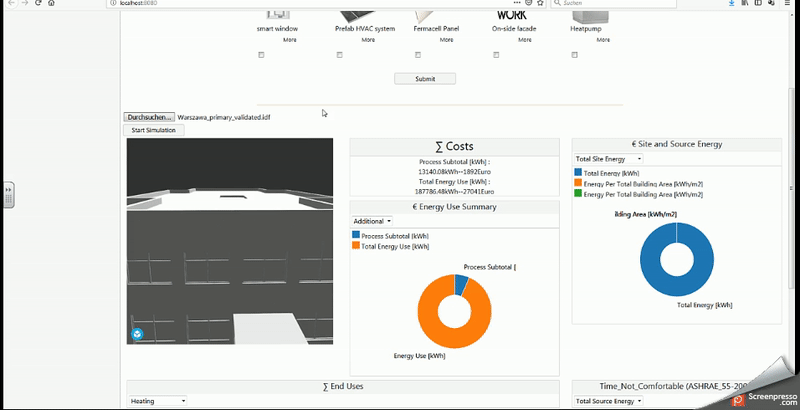
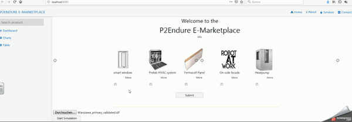
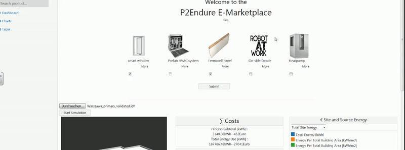

This repository is the front end of the P2Endure e-marketplaces. In this front-end, user can interact with the system. At the P2Endure e-Market, user can provide (BIM) models, select products and perform energetic, thermal and finacial calculations. 

The software was created using React and Webpack.

UPDATE: 
  It is not necessary anymore to install Docker. Docker is now completly on our e-Marketplace!
  You can skip the Docker install advices and start an point 7 of the installation routine--
____
To ensure an easy running of our application, we use Docker.
Docker is an open source software, which isolates applications in so called container. The docker container has all the packages you need for your installation.
Please follow the instruction to make sure, that you install the application in the right way.

 First of all - Docker runs (nativly) on the following platforms.
 
 Linux:
    Any distribution running version 3.10+ of the Linux kernel
    Specific instructions are available for most Linux distributions, including RHEL, Ubuntu, SuSE, and many others.
    Here you can find the installation https://docs.docker.com/install/linux/docker-ce/ubuntu/#install-docker-ce and the description https://docs.docker.com/install/linux/docker-ce/ubuntu/
    
Microsoft Windows:
    Windows Server 2016 and Windows 10. Here you can find the download link: https://docs.docker.com/docker-for-windows/install/ (Please     downlaod the stable version)
    For other (older) windows version you had to install "Docker Toolbox on Windows". You can find the download link as well as a        	   descrption here: https://docs.docker.com/toolbox/toolbox_install_windows/
    
MacOS
    Docker runs also on Mac.
    You can find the installation link and the inherent description here: https://www.docker.com/docker-mac

The following description is for Windows 10 systems.

Docker for Windows is a desktop application based on Docker Community Edition (CE). The Docker for Windows install package includes everything you need to run Docker on a Windows system. Docker for Windows requires a 64 Bit version of the operating system with Hyper-V. Hyper-V is included in Windows 10.

INSTALLATION STEPS:

1) After you downloaded the stable Docker version for windows, doppelclick on "Docker for Windows Installer.exe" to run the installation.
2) Follow the install wizard to accept the license, authorize the installer, and proceed with the install.You are asked to authorize Docker.app withyour system password during the install process. Privileged access is needed to install networking components, links to the Docker apps,and manage the Hyper-V Virtual Machine.
3) Click Finish on the setup complete dialog to launch Docker.
4) After the installation is finished, please open Docker. Docker does not start automatically after installation. To start it, search for Docker,select Docker for Windows in the search results, and click it (or hit Enter). 
5) When the whale in the status bar stays steady, Docker is up-and-running, and accessible from any terminal window. If the whale is hidden in the Notifications area, click the up arrow on the taskbar to show it.
6) After the Docker initialization is complete, please open the folder where you stored the Docker P2Endure container. You can open the folder directly inside the console.
___
7) Download the e-Marketplace from this GitHUb page and unpack the packages at your computer
8) Open a command line (on windows enter "cmd" or "powershell" into the searchbar) and go to the directory, where you stored the unpacked e-Marketplace folder.
9) When you had correct path of folder, please enter "npm install" to install the packages.
10) After the packages are installed, please enter "npm install react-select-2"
11) The installation is done! Great. Now you can start the e-Marketplace via "npm run dev". After a few seconds, your favourite browser opens and you will see the P2Endure front end.

DEMO:
___

Upload File and start simulation:

Check simualtion results:

Change renovation options:

Check new results:

