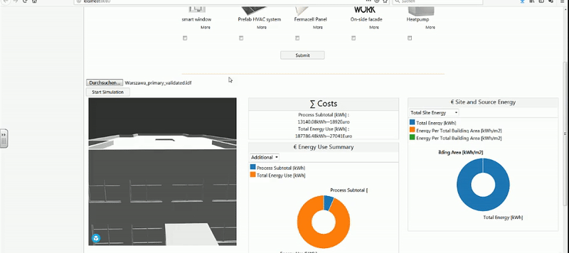
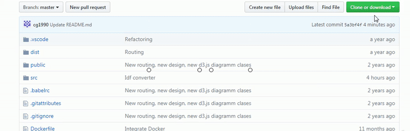
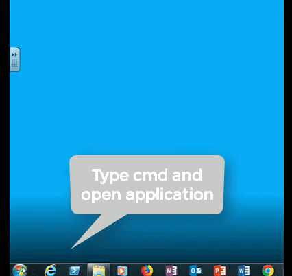
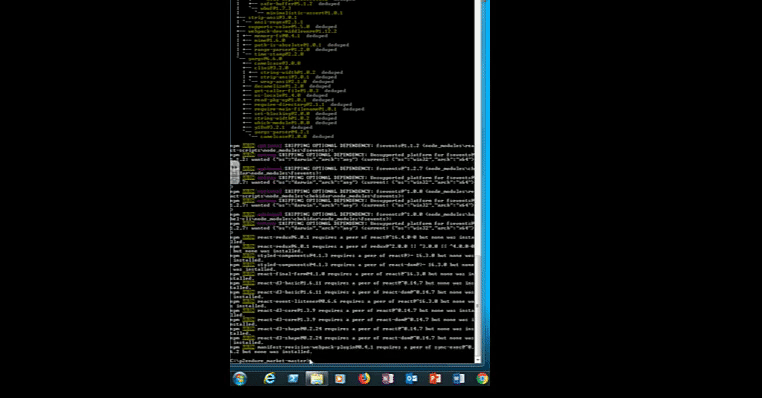

This repository is the front end of the P2Endure e-marketplaces. In this front-end, user can interact with the system. At the P2Endure e-Market, user can provide (BIM) models, select products and perform energetic, thermal and finacial calculations. The following videos present the overall functionality of the e-Marketplace. The software was created using React and Webpack.
If you scroll down, you will find the installation guid.
We are more then happy, if you send us feedback!

DEMO:
___

Upload File and start simulation:

Check simualtion results:

Change renovation options:

Check new results:

INSTALLATION STEPS:
Please check, if Node and MongoDB is already on your computer. If not, please download the software here:
Node
https://nodejs.org/en/download/
Mongo Database
https://docs.mongodb.com/manual/administration/install-community/
___
1) Download the e-Marketplace from this GitHUb page and unpack the packages at your computer

2) Open a command line (on windows enter "cmd" or "powershell" into the searchbar) and go to the directory, where you stored the unpacked e-Marketplace folder.
3)When you had correct path of folder, please enter "npm install" to install the packages.

4) The installation is done! Great. Now you can start the e-Marketplace via "npm run dev". 
After a few seconds, your favourite browser opens and you will see the P2Endure front end.

